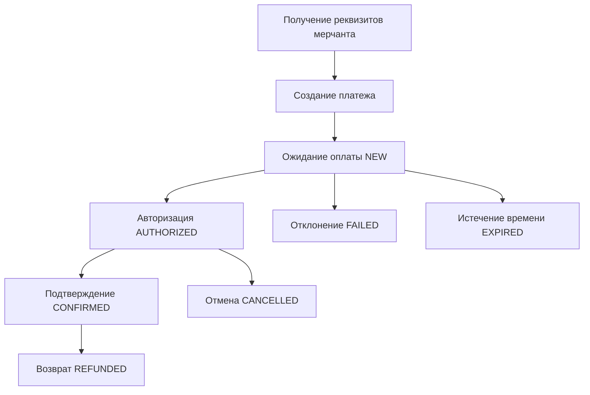

# Документация клиентского API платежного шлюза PaymentGateway

## Оглавление
1. [Жизненный цикл платежа](#жизненный-цикл-платежа)
2. [Аутентификация](#аутентификация)
3. [Коды ошибок](#коды-ошибок)
4. [API эндпоинты](#api-эндпоинты)
5. [Примеры запросов](#примеры-запросов)

---

## Жизненный цикл платежа

Система поддерживает полный жизненный цикл обработки платежей с несколькими стадиями:

### Стадии платежа



### 1. Регистрация мерчанта (Команда организаторов это делает. Реквизиты доступны в https://hub.hackload.kz)
- **Эндпоинт**: `POST /api/v1/TeamRegistration/register`
- **Назначение**: Регистрация нового мерчанта для приема платежей
- **Результат**: Получение учетных данных для API

### 2. Создание платежа
- **Эндпоинт**: `POST /api/v1/PaymentInit/init`
- **Назначение**: Создание нового платежного намерения
- **Статус**: `NEW`
- **Результат**: URL для оплаты покупателем

### 3. Обработка платежа
- **Процесс**: Покупатель вводит данные карты на платежной форме
- **Статус**: `NEW` → `AUTHORIZED`
- **Безопасность**: PCI DSS compliant обработка карточных данных

### 4. Подтверждение платежа
- **Эндпоинт**: `POST /api/v1/PaymentConfirm/confirm`
- **Назначение**: Подтверждение авторизованного платежа для списания средств
- **Статус**: `AUTHORIZED` → `CONFIRMED`

### 5. Проверка статуса
- **Эндпоинт**: `POST /api/v1/PaymentCheck/check`
- **Назначение**: Получение текущего статуса платежа
- **Поддержка**: Поиск по PaymentId или OrderId

### 6. Отмена платежа
- **Эндпоинт**: `POST /api/v1/PaymentCancel/cancel`
- **Назначение**: Отмена, реверс или возврат платежа
- **Типы**: Отмена (NEW), Реверс (AUTHORIZED), Возврат (CONFIRMED)

---

## Аутентификация

Система использует SHA-256 HMAC аутентификацию с защитой от повторных атак.

### Алгоритм генерации токена

**Краткая формула**: `Token = SHA256(Amount + Currency + OrderId + Password + TeamSlug)`

#### Детальный алгоритм:

1. **Сбор параметров**: Собираются **только скалярные параметры корневого уровня** из тела запроса
   - ✅ Включаются: все скалярные значения на корневом уровне
   - ❌ Исключаются: вложенные объекты (Receipt, Data, Items и др.)
   - ❌ Исключаются: массивы и сложные структуры

2. **Добавление пароля**: К собранным параметрам добавляется `Password` с паролем команды

3. **Алфавитная сортировка**: Параметры сортируются в **строгом алфавитном порядке** по названию поля (регистрозависимо)
   - **КРИТИЧНО**: Порядок всегда одинаковый: `Amount` → `Currency` → `OrderId` → `Password` → `TeamSlug`
   - Любое отклонение от этого порядка приводит к ошибке аутентификации

4. **Конкатенация значений**: Значения параметров (не ключи!) конкатенируются без разделителей
   - Пример: `"19200" + "RUB" + "order-123" + "MyPassword123" + "my-team"`
   - Результат: `"19200RUBorder-123MyPassword123my-team"`

5. **SHA-256 хеширование**: К получившейся строке применяется SHA-256 с кодировкой UTF-8
   - Результат: строка в нижнем регистре (hex)

#### Важные особенности:

- **Тип данных**: все значения конвертируются в строки перед конкатенацией
- **Кодировка**: обязательно UTF-8 для хеширования
- **Регистр**: сортировка ключей регистрозависимая
- **Исключения**: вложенные объекты (Receipt, Data, Items) НЕ участвуют в генерации токена

### Пример генерации токена

```bash
# Исходные параметры
amount="19200"
currency="RUB"
orderId="21090"
teamSlug="MerchantTeamSlug"
password="usaf8fw8fsw21g"

# КРИТИЧНО: Параметры ВСЕГДА в строгом алфавитном порядке:
# Amount → Currency → OrderId → Password → TeamSlug
token_params="${amount}${currency}${orderId}Password${password}${teamSlug}"

echo "Строка для хеширования: $token_params"
# Результат: "19200RUB21090Passwordusaf8fw8fsw21gMerchantTeamSlug"

# Генерация токена SHA-256
token=$(echo -n "$token_params" | sha256sum | cut -d' ' -f1)
echo "Сгенерированный токен: $token"
```

#### Пошаговый пример:

1. **Исходный запрос**:
```json
{
  "teamSlug": "MerchantTeamSlug",
  "amount": 19200,
  "orderId": "21090",
  "currency": "RUB",
  "description": "Подарочная карта", // Исключается из токена
  "receipt": { ... }               // Исключается из токена
}
```

2. **Извлеченные параметры** (только скалярные):
```
teamSlug: "MerchantTeamSlug"
amount: "19200"
orderId: "21090" 
currency: "RUB"
```

3. **Добавление пароля**:
```
amount: "19200"
currency: "RUB"
orderId: "21090"
password: "usaf8fw8fsw21g"
teamSlug: "MerchantTeamSlug"
```

4. **Алфавитная сортировка** (Amount → Currency → OrderId → Password → TeamSlug):
```
Amount: "19200"
Currency: "RUB"  
OrderId: "21090"
Password: "usaf8fw8fsw21g"
TeamSlug: "MerchantTeamSlug"
```

5. **Конкатенация значений**:
```
"19200RUB21090usaf8fw8fsw21gMerchantTeamSlug"
```

6. **SHA-256 хеширование**:
```
Input:  "19200RUB21090usaf8fw8fsw21gMerchantTeamSlug"
Output: "b8f2f8e5c9d6a4c8f7b5e3a2d1f0e9c8b7a6f5d4e3c2b1a0f9e8d7c6b5a4f3e2"
```

### Безопасность

- **Защита от повторов**: Каждый токен уникален для конкретного набора параметров
- **Временные окна**: Рекомендуется использовать короткие временные окна для запросов
- **HTTPS**: Все запросы должны выполняться по HTTPS

---

## Коды ошибок

### Ошибки инициализации платежа (1xxx)

| Код | Описание | HTTP Статус | Действие |
|-----|----------|-------------|----------|
| 1000 | Неверное тело запроса | 400 | Проверить формат JSON |
| 1001 | Ошибка аутентификации | 401 | Проверить teamSlug и token |
| 1002 | Дублирующийся платеж | 409 | Изменить orderId или дождаться завершения |
| 1003 | Неверный аргумент | 400 | Проверить значения параметров |
| 1004 | Недостаточно средств | 402 | Пополнить баланс |
| 1005 | Превышение лимитов | 400 | Уменьшить сумму или связаться с поддержкой |
| 1006 | Неподдерживаемая валюта | 400 | Использовать RUB, USD или EUR |
| 1007 | Ошибка платежного провайдера | 402 | Повторить позже |
| 1100 | Ошибка валидации | 400 | Исправить данные запроса |
| 1404 | Платеж не найден | 404 | Проверить paymentId |
| 1408 | Превышение времени ожидания | 408 | Повторить запрос |
| 1422 | Нарушение бизнес-правил | 422 | Проверить ограничения |
| 1429 | Превышение лимита запросов | 429 | Дождаться и повторить |
| 9998 | Ошибка системы | 500 | Обратиться в поддержку |
| 9999 | Внутренняя ошибка сервера | 500 | Обратиться в поддержку |

### Ошибки проверки статуса (1xxx)

| Код | Описание | HTTP Статус | Действие |
|-----|----------|-------------|----------|
| 1000 | Неверное тело запроса | 400 | Проверить formат JSON |
| 1001 | Ошибка аутентификации | 401 | Проверить teamSlug и token |
| 1003 | Неверный аргумент | 400 | Проверить paymentId или orderId |
| 1100 | Ошибка валидации | 400 | Исправить данные запроса |
| 1404 | Платеж не найден | 404 | Проверить paymentId/orderId |
| 1408 | Превышение времени ожидания | 408 | Повторить запрос |
| 1429 | Превышение лимита запросов | 429 | Дождаться и повторить |
| 9999 | Внутренняя ошибка сервера | 500 | Обратиться в поддержку |

### Ошибки подтверждения платежа (2xxx)

| Код | Описание | HTTP Статус | Действие |
|-----|----------|-------------|----------|
| 2000 | Неверное тело запроса | 400 | Проверить формат JSON |
| 2001 | Ошибка аутентификации | 401 | Проверить teamSlug и token |
| 2003 | Неверный аргумент | 400 | Проверить значения параметров |
| 2100 | Ошибка валидации | 400 | Исправить данные запроса |
| 2404 | Платеж не найден | 404 | Проверить paymentId |
| 2408 | Превышение времени ожидания | 408 | Повторить запрос |
| 2409 | Платеж уже подтвержден | 409 | Проверить статус платежа |
| 2429 | Превышение лимита запросов | 429 | Дождаться и повторить |
| 9999 | Внутренняя ошибка сервера | 500 | Обратиться в поддержку |

### Ошибки отмены платежа (3xxx)

| Код | Описание | HTTP Статус | Действие |
|-----|----------|-------------|----------|
| 3000 | Неверное тело запроса | 400 | Проверить формат JSON |
| 3001 | Ошибка аутентификации | 401 | Проверить teamSlug и token |
| 3003 | Неверный аргумент | 400 | Проверить значения параметров |
| 3100 | Ошибка валидации | 400 | Исправить данные запроса |
| 3404 | Платеж не найден | 404 | Проверить paymentId |
| 3408 | Превышение времени ожидания | 408 | Повторить запрос |
| 3409 | Платеж уже отменен | 409 | Проверить статус платежа |
| 3422 | Нарушение бизнес-правил | 422 | Частичная отмена не поддерживается |
| 3429 | Превышение лимита запросов | 429 | Дождаться и повторить |
| 3503 | Сервис временно недоступен | 503 | Повторить позже |
| 9999 | Внутренняя ошибка сервера | 500 | Обратиться в поддержку |

### Ошибки регистрации команды (2xxx)

| Код | Описание | HTTP Статус | Действие |
|-----|----------|-------------|----------|
| 2001 | Неверные данные запроса | 400 | Исправить данные |
| 2002 | TeamSlug уже существует | 409 | Выбрать другой teamSlug |
| 2003 | Email уже зарегистрирован | 409 | Использовать другой email |
| 2004 | Условия не приняты | 400 | Принять условия обслуживания |
| 2404 | Команда не найдена | 404 | Проверить teamSlug |
| 2429 | Превышение лимита регистраций | 429 | Дождаться и повторить |
| 9999 | Внутренняя ошибка сервера | 500 | Обратиться в поддержку |

---

## API эндпоинты

### 1. Регистрация команды

**POST** `/api/v1/TeamRegistration/register`

Регистрация нового мерчанта для приема платежей.

**Заголовки:**
```
Content-Type: application/json
```

**Тело запроса:**
```json
{
  "teamSlug": "my-online-store",
  "password": "SecurePassword123!",
  "teamName": "My Online Store",
  "email": "merchant@mystore.com",
  "phone": "+1234567890",
  "successURL": "https://mystore.com/payment/success",
  "failURL": "https://mystore.com/payment/fail",
  "notificationURL": "https://mystore.com/payment/webhook",
  "supportedCurrencies": "RUB,USD,EUR",
  "businessInfo": {
    "businessType": "ecommerce",
    "website": "https://mystore.com"
  },
  "acceptTerms": true
}
```

**Ответ (201 Created):**
```json
{
  "success": true,
  "message": "Team registered successfully",
  "teamSlug": "my-online-store",
  "teamId": "123e4567-e89b-12d3-a456-426614174000",
  "passwordHashPreview": "d3ad9315...",
  "createdAt": "2025-08-06T10:30:00Z",
  "status": "ACTIVE",
  "apiEndpoint": "https://gateway.hackload.com/api/v1",
  "details": {
    "teamName": "My Online Store",
    "email": "merchant@mystore.com",
    "supportedCurrencies": ["RUB", "USD", "EUR"],
    "nextSteps": [
      "Test payment initialization using your credentials",
      "Configure webhook endpoint for notifications",
      "Review API documentation for integration"
    ]
  }
}
```

### 2. Создание платежа

**POST** `/api/v1/PaymentInit/init`

Создание нового платежного намерения.

**Заголовки:**
```
Content-Type: application/json
```

**Тело запроса:**
```json
{
  "teamSlug": "my-store",
  "token": "eyJ0eXAiOiJKV1QiLCJhbGciOiJIUzI1NiJ9...",
  "amount": 150000,
  "orderId": "order-12345",
  "currency": "RUB",
  "description": "Book purchase",
  "successURL": "https://mystore.com/success",
  "failURL": "https://mystore.com/fail",
  "notificationURL": "https://mystore.com/webhook",
  "paymentExpiry": 30,
  "email": "customer@example.com",
  "language": "ru"
}
```

**Ответ (200 OK):**
```json
{
  "success": true,
  "paymentId": "pay_123456789",
  "orderId": "order-12345",
  "status": "NEW",
  "amount": 150000,
  "currency": "RUB",
  "paymentURL": "https://gateway.hackload.com/payment/pay_123456789",
  "expiresAt": "2025-01-30T12:30:00Z",
  "createdAt": "2025-01-30T12:00:00Z"
}
```

### 3. Проверка статуса платежа

**POST** `/api/v1/PaymentCheck/check`

Получение статуса платежа по PaymentId или OrderId.

**Заголовки:**
```
Content-Type: application/json
```

**Тело запроса (по PaymentId):**
```json
{
  "teamSlug": "my-store",
  "token": "eyJ0eXAiOiJKV1QiLCJhbGciOiJIUzI1NiJ9...",
  "paymentId": "pay_123456789",
  "includeTransactions": true,
  "includeCardDetails": true,
  "includeCustomerInfo": false,
  "includeReceipt": false,
  "language": "ru"
}
```

**Тело запроса (по OrderId):**
```json
{
  "teamSlug": "my-store",
  "token": "eyJ0eXAiOiJKV1QiLCJhbGciOiJIUzI1NiJ9...",
  "orderId": "order-12345",
  "includeTransactions": false,
  "includeCardDetails": false,
  "includeCustomerInfo": true,
  "includeReceipt": true,
  "language": "en"
}
```

**Ответ (200 OK):**
```json
{
  "success": true,
  "payments": [
    {
      "paymentId": "pay_123456789",
      "orderId": "order-12345",
      "status": "CONFIRMED",
      "statusDescription": "Payment confirmed successfully",
      "amount": 150000,
      "currency": "RUB",
      "createdAt": "2025-01-30T12:00:00Z",
      "updatedAt": "2025-01-30T12:05:00Z",
      "expiresAt": "2025-01-30T12:30:00Z",
      "description": "Book purchase",
      "payType": "O"
    }
  ],
  "totalCount": 1,
  "orderId": "order-12345"
}
```

### 4. Подтверждение платежа

**POST** `/api/v1/PaymentConfirm/confirm`

Подтверждение авторизованного платежа для списания средств.

**Заголовки:**
```
Content-Type: application/json
```

**Тело запроса:**
```json
{
  "teamSlug": "my-store",
  "token": "eyJ0eXAiOiJKV1QiLCJhbGciOiJIUzI1NiJ9...",
  "paymentId": "pay_123456789",
  "amount": 150000,
  "description": "Order confirmation for books",
  "receipt": {
    "email": "customer@example.com",
    "phone": "+79001234567"
  },
  "data": {
    "confirmationReason": "Customer payment approved",
    "merchantReference": "ORDER-12345"
  }
}
```

**Ответ (200 OK):**
```json
{
  "success": true,
  "paymentId": "pay_123456789",
  "orderId": "order-12345",
  "status": "CONFIRMED",
  "authorizedAmount": 150000,
  "confirmedAmount": 150000,
  "remainingAmount": 0,
  "currency": "RUB",
  "confirmedAt": "2025-01-30T12:05:00Z",
  "bankDetails": {
    "bankTransactionId": "bank_txn_789",
    "authorizationCode": "AUTH123",
    "rrn": "123456789012",
    "responseCode": "00",
    "responseMessage": "Approved"
  },
  "fees": {
    "processingFee": 3000,
    "totalFees": 3000,
    "feeCurrency": "RUB"
  },
  "settlement": {
    "settlementDate": "2025-01-31T00:00:00Z",
    "settlementAmount": 147000,
    "settlementCurrency": "RUB"
  }
}
```

### 5. Отмена платежа

**POST** `/api/v1/PaymentCancel/cancel`

Отмена, реверс или возврат платежа в зависимости от его статуса.

**Заголовки:**
```
Content-Type: application/json
```

**Тело запроса:**
```json
{
  "teamSlug": "my-store",
  "token": "eyJ0eXAiOiJKV1QiLCJhbGciOiJIUzI1NiJ9...",
  "paymentId": "pay_123456789",
  "reason": "Customer requested cancellation",
  "receipt": {
    "email": "customer@example.com",
    "phone": "+79001234567",
    "taxation": "osn"
  },
  "force": false,
  "data": {
    "externalRequestId": "cancel_req_12345",
    "customerReason": "Changed mind",
    "merchantReference": "CANCEL-ORDER-12345"
  }
}
```

**Ответ (200 OK) - Возврат:**
```json
{
  "success": true,
  "paymentId": "pay_123456789",
  "orderId": "order-12345",
  "status": "REFUNDED",
  "cancellationType": "FULL_REFUND",
  "originalAmount": 150000,
  "cancelledAmount": 150000,
  "remainingAmount": 0,
  "currency": "RUB",
  "cancelledAt": "2025-01-30T12:10:00Z",
  "bankDetails": {
    "bankTransactionId": "bank_cancel_789",
    "originalAuthorizationCode": "AUTH123",
    "cancellationAuthorizationCode": "REFUND456",
    "rrn": "123456789012",
    "responseCode": "00",
    "responseMessage": "Refund Approved"
  },
  "refund": {
    "refundId": "refund_789",
    "refundStatus": "PROCESSING",
    "expectedProcessingTime": "3-5 business days",
    "refundMethod": "card",
    "cardInfo": {
      "cardMask": "4111****1111",
      "cardType": "Visa",
      "issuingBank": "Sberbank"
    }
  },
  "details": {
    "reason": "Customer requested cancellation",
    "wasForced": false,
    "processingDuration": "00:00:01.250"
  }
}
```


---

## Примеры запросов

### Создание платежа с полной аутентификацией

```bash
#!/bin/bash

# Параметры платежа
team_slug="my-test-store"
password="MySecretPassword123"
amount="250000"
order_id="order-$(date +%s)"
currency="RUB"
description="Test payment"
email="customer@example.com"
success_url="https://mystore.com/success"
fail_url="https://mystore.com/fail"

# Генерация токена (параметры в алфавитном порядке)
token_params="${amount}${currency}${description}${email}${fail_url}${order_id}${success_url}${team_slug}Password${password}"
token=$(echo -n "$token_params" | sha256sum | cut -d' ' -f1)

# Создание платежа
curl -X POST https://gateway.hackload.com/api/v1/PaymentInit/init \
  -H "Content-Type: application/json" \
  -d "{
    \"teamSlug\": \"$team_slug\",
    \"token\": \"$token\",
    \"amount\": $amount,
    \"orderId\": \"$order_id\",
    \"currency\": \"$currency\",
    \"description\": \"$description\",
    \"email\": \"$email\",
    \"successURL\": \"$success_url\",
    \"failURL\": \"$fail_url\",
    \"language\": \"ru\"
  }"
```

### Проверка статуса платежа

```bash
#!/bin/bash

# Параметры для проверки
team_slug="my-test-store"
password="MySecretPassword123"
payment_id="pay_123456789"

# Простой токен для проверки статуса (минимальные параметры)
token_params="${payment_id}${team_slug}Password${password}"
token=$(echo -n "$token_params" | sha256sum | cut -d' ' -f1)

# Проверка статуса
curl -X POST https://gateway.hackload.com/api/v1/PaymentCheck/check \
  -H "Content-Type: application/json" \
  -d "{
    \"teamSlug\": \"$team_slug\",
    \"token\": \"$token\",
    \"paymentId\": \"$payment_id\",
    \"includeTransactions\": true,
    \"includeCardDetails\": true,
    \"language\": \"ru\"
  }"
```

### Подтверждение платежа

```bash
#!/bin/bash

# Параметры для подтверждения
team_slug="my-test-store"
password="MySecretPassword123"
payment_id="pay_123456789"
amount="250000"

# Токен для подтверждения
token_params="${amount}${payment_id}${team_slug}Password${password}"
token=$(echo -n "$token_params" | sha256sum | cut -d' ' -f1)

# Подтверждение платежа
curl -X POST https://gateway.hackload.com/api/v1/PaymentConfirm/confirm \
  -H "Content-Type: application/json" \
  -d "{
    \"teamSlug\": \"$team_slug\",
    \"token\": \"$token\",
    \"paymentId\": \"$payment_id\",
    \"amount\": $amount,
    \"description\": \"Order confirmation\"
  }"
```

### Отмена платежа

```bash
#!/bin/bash

# Параметры для отмены
team_slug="my-test-store"
password="MySecretPassword123"
payment_id="pay_123456789"
reason="Customer requested cancellation"

# Токен для отмены
token_params="${payment_id}${team_slug}Password${password}"
token=$(echo -n "$token_params" | sha256sum | cut -d' ' -f1)

# Отмена платежа
curl -X POST https://gateway.hackload.com/api/v1/PaymentCancel/cancel \
  -H "Content-Type: application/json" \
  -d "{
    \"teamSlug\": \"$team_slug\",
    \"token\": \"$token\",
    \"paymentId\": \"$payment_id\",
    \"reason\": \"$reason\"
  }"
```

### Интеграция с webhook уведомлениями

```javascript
// Пример обработчика webhook уведомлений (Node.js)
const express = require('express');
const crypto = require('crypto');
const app = express();

app.use(express.json());

// Webhook endpoint
app.post('/payment/webhook', (req, res) => {
  const payment = req.body;
  
  // Логирование уведомления
  console.log('Payment notification received:', {
    paymentId: payment.paymentId,
    orderId: payment.orderId,
    status: payment.status,
    amount: payment.amount,
    currency: payment.currency
  });
  
  // Обработка различных статусов
  switch (payment.status) {
    case 'CONFIRMED':
      // Платеж подтвержден - выполнить заказ
      processOrder(payment.orderId, payment.amount);
      break;
      
    case 'FAILED':
      // Платеж не прошел - уведомить покупателя
      notifyPaymentFailure(payment.orderId);
      break;
      
    case 'REFUNDED':
      // Возврат - обработать возврат товара
      processRefund(payment.orderId, payment.amount);
      break;
  }
  
  // Подтверждение получения webhook
  res.status(200).json({ received: true });
});

function processOrder(orderId, amount) {
  // Логика обработки заказа
  console.log(`Processing order ${orderId} for amount ${amount}`);
}

function notifyPaymentFailure(orderId) {
  // Логика уведомления о неудачной оплате
  console.log(`Payment failed for order ${orderId}`);
}

function processRefund(orderId, amount) {
  // Логика обработки возврата
  console.log(`Processing refund for order ${orderId}, amount ${amount}`);
}

app.listen(3000, () => {
  console.log('Webhook server running on port 3000');
});
```

### Полный пример интеграции

```python
# Python пример полной интеграции
import hashlib
import requests
import json
from datetime import datetime

class PaymentGatewayClient:
    def __init__(self, team_slug, password, base_url="https://gateway.hackload.com/api/v1"):
        self.team_slug = team_slug
        self.password = password
        self.base_url = base_url
    
    def generate_token(self, params):
        """Генерация токена аутентификации"""
        # Сортируем параметры в алфавитном порядке
        sorted_params = sorted(params.items())
        
        # Конкатенируем значения
        token_string = ''.join(str(value) for key, value in sorted_params)
        
        # Добавляем пароль
        token_string += f"Password{self.password}"
        
        # Генерируем SHA-256 хеш
        return hashlib.sha256(token_string.encode()).hexdigest()
    
    def create_payment(self, amount, order_id, currency="RUB", **kwargs):
        """Создание нового платежа"""
        params = {
            'amount': str(amount),
            'currency': currency,
            'orderId': order_id,
            'teamSlug': self.team_slug
        }
        
        # Добавляем дополнительные параметры
        for key, value in kwargs.items():
            if value is not None:
                params[key] = str(value)
        
        # Генерируем токен
        token = self.generate_token(params)
        
        # Подготавливаем запрос
        request_data = params.copy()
        request_data['token'] = token
        
        # Отправляем запрос
        response = requests.post(
            f"{self.base_url}/PaymentInit/init",
            json=request_data,
            headers={'Content-Type': 'application/json'}
        )
        
        return response.json()
    
    def check_payment_status(self, payment_id=None, order_id=None):
        """Проверка статуса платежа"""
        params = {
            'teamSlug': self.team_slug
        }
        
        if payment_id:
            params['paymentId'] = payment_id
        elif order_id:
            params['orderId'] = order_id
        else:
            raise ValueError("Either payment_id or order_id must be provided")
        
        # Генерируем токен
        token = self.generate_token(params)
        
        # Подготавливаем запрос
        request_data = params.copy()
        request_data['token'] = token
        request_data['includeTransactions'] = True
        
        # Отправляем запрос
        response = requests.post(
            f"{self.base_url}/PaymentCheck/check",
            json=request_data,
            headers={'Content-Type': 'application/json'}
        )
        
        return response.json()
    
    def confirm_payment(self, payment_id, amount):
        """Подтверждение платежа"""
        params = {
            'amount': str(amount),
            'paymentId': payment_id,
            'teamSlug': self.team_slug
        }
        
        # Генерируем токен
        token = self.generate_token(params)
        
        # Подготавливаем запрос
        request_data = params.copy()
        request_data['token'] = token
        
        # Отправляем запрос
        response = requests.post(
            f"{self.base_url}/PaymentConfirm/confirm",
            json=request_data,
            headers={'Content-Type': 'application/json'}
        )
        
        return response.json()
    
    def cancel_payment(self, payment_id, reason="API cancellation"):
        """Отмена платежа"""
        params = {
            'paymentId': payment_id,
            'teamSlug': self.team_slug
        }
        
        # Генерируем токен
        token = self.generate_token(params)
        
        # Подготавливаем запрос
        request_data = params.copy()
        request_data['token'] = token
        request_data['reason'] = reason
        
        # Отправляем запрос
        response = requests.post(
            f"{self.base_url}/PaymentCancel/cancel",
            json=request_data,
            headers={'Content-Type': 'application/json'}
        )
        
        return response.json()

# Пример использования
if __name__ == "__main__":
    # Создаем клиента
    client = PaymentGatewayClient("my-store", "MySecretPassword123")
    
    # Создаем платеж
    payment_result = client.create_payment(
        amount=100000,  # 1000 рублей в копейках
        order_id=f"order-{datetime.now().strftime('%Y%m%d-%H%M%S')}",
        currency="RUB",
        description="Test payment",
        email="customer@example.com",
        successURL="https://mystore.com/success",
        failURL="https://mystore.com/fail"
    )
    
    if payment_result.get('success'):
        payment_id = payment_result['paymentId']
        print(f"Payment created: {payment_id}")
        print(f"Payment URL: {payment_result['paymentURL']}")
        
        # Проверяем статус
        status_result = client.check_payment_status(payment_id=payment_id)
        print(f"Payment status: {status_result}")
        
    else:
        print(f"Payment creation failed: {payment_result}")
```

---

## Важные примечания

1. **Безопасность**: Никогда не передавайте пароль команды в открытом виде. Используйте HTTPS для всех запросов.
2. **Idempotency**: Для критичных операций используйте поля идемпотентности (externalRequestId, idempotencyKey).
3. **Webhook**: Настройте обработку webhook уведомлений для получения актуального статуса платежей.
4. **Тестирование**: Используйте тестовые данные карт для проверки интеграции.
5. **Мониторинг**: Логируйте все запросы и ответы API для диагностики проблем.
6. **Rate Limiting**: Соблюдайте лимиты частоты запросов для избежания блокировок.