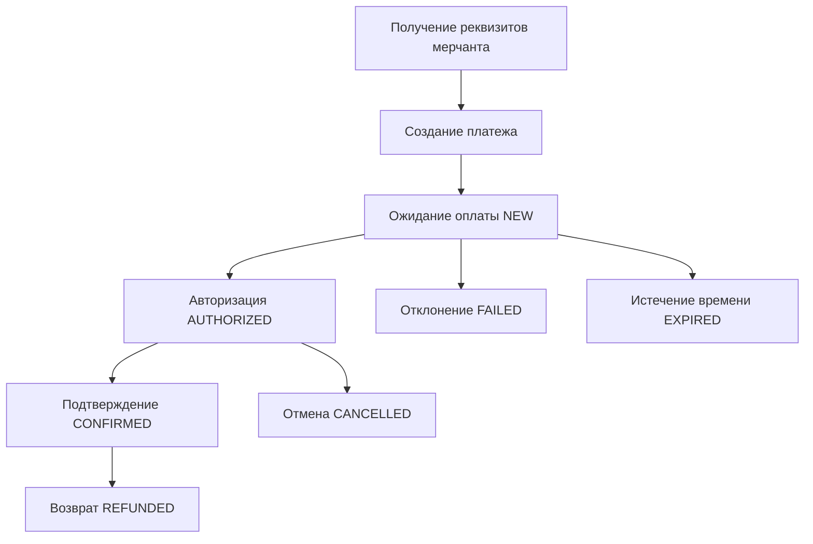

# Документация клиентского API платежного шлюза PaymentGateway

## Оглавление
1. [Жизненный цикл платежа](#жизненный-цикл-платежа)
2. [Аутентификация](#аутентификация)
3. [Коды ошибок](#коды-ошибок)
4. [API эндпоинты](#api-эндпоинты)
5. [Примеры запросов](#примеры-запросов)

---

## Жизненный цикл платежа

Система поддерживает полный жизненный цикл обработки платежей с несколькими стадиями:

### Стадии платежа



### 1. Регистрация мерчанта (Команда организаторов это делает. Реквизиты доступны в https://hub.hackload.kz)
- **Эндпоинт**: `POST /api/v1/TeamRegistration/register`
- **Назначение**: Регистрация нового мерчанта для приема платежей
- **Результат**: Получение учетных данных для API

### 2. Создание платежа
- **Эндпоинт**: `POST /api/v1/PaymentInit/init`
- **Назначение**: Создание нового платежного намерения
- **Статус**: `NEW`
- **Результат**: URL для оплаты покупателем

### 3. Обработка платежа
- **Процесс**: Покупатель вводит данные карты на платежной форме
- **Статус**: `NEW` → `AUTHORIZED`
- **Безопасность**: PCI DSS compliant обработка карточных данных

### 4. Подтверждение платежа
- **Эндпоинт**: `POST /api/v1/PaymentConfirm/confirm`
- **Назначение**: Подтверждение авторизованного платежа для списания средств
- **Статус**: `AUTHORIZED` → `CONFIRMED`

### 5. Проверка статуса
- **Эндпоинт**: `POST /api/v1/PaymentCheck/check`
- **Назначение**: Получение текущего статуса платежа
- **Поддержка**: Поиск по PaymentId или OrderId

### 6. Отмена платежа
- **Эндпоинт**: `POST /api/v1/PaymentCancel/cancel`
- **Назначение**: Отмена, реверс или возврат платежа
- **Типы**: Отмена (NEW), Реверс (AUTHORIZED), Возврат (CONFIRMED)

---

## Аутентификация

Система использует SHA-256 HMAC аутентификацию с защитой от повторных атак.

### Алгоритм генерации токена (УПРОЩЕННАЯ ВЕРСИЯ)

**Краткая формула**: `Token = SHA256(Amount + Currency + OrderId + Password + TeamSlug)`

#### Детальный алгоритм:

**ВАЖНО**: Система использует упрощенную схему аутентификации с **только 5 основными параметрами**.

**⚠️ ИСКЛЮЧЕНИЕ**: Эндпоинт `PaymentCheck` использует **СПЕЦИАЛЬНУЮ** формулу аутентификации.

1. **Сбор параметров**: Используются **только 5 обязательных параметров**:
   - ✅ **Amount** - сумма платежа в копейках
   - ✅ **Currency** - валюта платежа (например, "RUB")
   - ✅ **OrderId** - уникальный идентификатор заказа
   - ✅ **TeamSlug** - идентификатор команды
   - ✅ **Password** - пароль команды (добавляется автоматически)
   - ❌ **Исключаются**: ВСЕ остальные параметры (Description, Email, URLs, etc.)

2. **Добавление пароля**: К 4 параметрам запроса автоматически добавляется `Password` команды

3. **Фиксированный порядок**: Параметры **ВСЕГДА** используются в строгом алфавитном порядке:
   - **КРИТИЧНО**: `Amount` → `Currency` → `OrderId` → `Password` → `TeamSlug`
   - Этот порядок НЕ меняется независимо от порядка в JSON запросе

### 🔐 СПЕЦИАЛЬНАЯ АУТЕНТИФИКАЦИЯ ДЛЯ PaymentCheck

**Эндпоинт**: `POST /api/v1/PaymentCheck/check`

**⚠️ ВАЖНО**: PaymentCheck использует **ОТЛИЧНУЮ** от других эндпоинтов формулу аутентификации.

**Формула**: `Token = SHA256(PaymentId + Password + TeamSlug)`

**Порядок параметров**: `PaymentId` → `Password` → `TeamSlug` (НЕ алфавитный!)

#### Особенности PaymentCheck аутентификации:

1. **Только 3 параметра**: PaymentId, Password, TeamSlug
2. **Фиксированный порядок**: PaymentId → Password → TeamSlug (НЕ алфавитный)
3. **PaymentId обязателен**: При проверке статуса всегда используется PaymentId

4. **Конкатенация значений**: Значения параметров конкатенируются без разделителей
   - Пример: `"19200" + "RUB" + "order-123" + "MyPassword123" + "my-team"`
   - Результат: `"19200RUBorder-123MyPassword123my-team"`

5. **SHA-256 хеширование**: К получившейся строке применяется SHA-256 с кодировкой UTF-8
   - Результат: строка в нижнем регистре (hex)

#### Важные особенности упрощенной схемы:

- **Только 5 параметров**: Независимо от содержимого JSON запроса, в токене участвуют только Amount, Currency, OrderId, Password, TeamSlug
- **Игнорирование остальных полей**: Description, Email, URLs, Receipt, Data и все остальные поля НЕ влияют на токен
- **Простота интеграции**: Не нужно анализировать структуру запроса - всегда используются одни и те же 5 полей
- **Обратная совместимость**: Токены генерируются одинаково для простых и сложных запросов

### Пример генерации токена (УПРОЩЕННАЯ СХЕМА)

```bash
# Исходные параметры (только 5 обязательных)
amount="19200"
currency="RUB"
orderId="21090"
teamSlug="MerchantTeamSlug"
password="usaf8fw8fsw21g"

# КРИТИЧНО: Параметры ВСЕГДА в строгом алфавитном порядке:
# Amount → Currency → OrderId → Password → TeamSlug
token_params="${amount}${currency}${orderId}${password}${teamSlug}"

echo "Строка для хеширования: $token_params"
# Результат: "19200RUB21090usaf8fw8fsw21gMerchantTeamSlug"

# Генерация токена SHA-256
token=$(echo -n "$token_params" | sha256sum | cut -d' ' -f1)
echo "Сгенерированный токен: $token"

# ВАЖНО: Даже если запрос содержит дополнительные поля, 
# они НЕ участвуют в генерации токена:
curl -X POST /api/v1/PaymentInit/init \
  -H "Content-Type: application/json" \
  -d "{
    \"teamSlug\": \"$teamSlug\",
    \"token\": \"$token\",
    \"amount\": $amount,
    \"orderId\": \"$orderId\",
    \"currency\": \"$currency\",
    \"description\": \"Это поле НЕ влияет на токен\",
    \"email\": \"customer@example.com\",
    \"successURL\": \"https://example.com/success\",
    \"failURL\": \"https://example.com/fail\"
  }"
```

#### Пошаговый пример упрощенной аутентификации:

1. **Исходный запрос** (может содержать любые поля):
```json
{
  "teamSlug": "MerchantTeamSlug",
  "amount": 19200,
  "orderId": "21090",
  "currency": "RUB",
  "description": "Подарочная карта",     // ❌ ИГНОРИРУЕТСЯ
  "email": "customer@example.com",      // ❌ ИГНОРИРУЕТСЯ
  "successURL": "https://example.com",  // ❌ ИГНОРИРУЕТСЯ
  "receipt": { ... },                   // ❌ ИГНОРИРУЕТСЯ
  "data": { ... }                       // ❌ ИГНОРИРУЕТСЯ
}
```

2. **Извлеченные параметры** (ТОЛЬКО 5 основных):
```
Amount: "19200"     ✅ ИСПОЛЬЗУЕТСЯ
Currency: "RUB"     ✅ ИСПОЛЬЗУЕТСЯ
OrderId: "21090"    ✅ ИСПОЛЬЗУЕТСЯ
TeamSlug: "MerchantTeamSlug"  ✅ ИСПОЛЬЗУЕТСЯ
```

3. **Добавление пароля**:
```
Amount: "19200"
Currency: "RUB"
OrderId: "21090"
Password: "usaf8fw8fsw21g"  ✅ ДОБАВЛЯЕТСЯ АВТОМАТИЧЕСКИ
TeamSlug: "MerchantTeamSlug"
```

4. **Фиксированный порядок** (Amount → Currency → OrderId → Password → TeamSlug):
```
Amount: "19200"
Currency: "RUB"  
OrderId: "21090"
Password: "usaf8fw8fsw21g"
TeamSlug: "MerchantTeamSlug"
```

5. **Конкатенация значений**:
```
"19200RUB21090usaf8fw8fsw21gMerchantTeamSlug"
```

6. **SHA-256 хеширование**:
```
Input:  "19200RUB21090usaf8fw8fsw21gMerchantTeamSlug"
Output: "b8f2f8e5c9d6a4c8f7b5e3a2d1f0e9c8b7a6f5d4e3c2b1a0f9e8d7c6b5a4f3e2"
```

**Ключевая особенность**: Независимо от количества полей в JSON, токен всегда генерируется из одних и тех же 5 параметров!

### Безопасность

- **Защита от повторов**: Каждый токен уникален для конкретного набора параметров
- **Временные окна**: Рекомендуется использовать короткие временные окна для запросов
- **HTTPS**: Все запросы должны выполняться по HTTPS

---

## Коды ошибок

### Ошибки инициализации платежа (1xxx)

| Код | Описание | HTTP Статус | Действие |
|-----|----------|-------------|----------|
| 1000 | Неверное тело запроса | 400 | Проверить формат JSON |
| 1001 | Ошибка аутентификации | 401 | Проверить teamSlug и token |
| 1002 | Дублирующийся платеж | 409 | Изменить orderId или дождаться завершения |
| 1003 | Неверный аргумент | 400 | Проверить значения параметров |
| 1004 | Недостаточно средств | 402 | Пополнить баланс |
| 1005 | Превышение лимитов | 400 | Уменьшить сумму или связаться с поддержкой |
| 1006 | Неподдерживаемая валюта | 400 | Использовать RUB, USD или EUR |
| 1007 | Ошибка платежного провайдера | 402 | Повторить позже |
| 1100 | Ошибка валидации | 400 | Исправить данные запроса |
| 1404 | Платеж не найден | 404 | Проверить paymentId |
| 1408 | Превышение времени ожидания | 408 | Повторить запрос |
| 1422 | Нарушение бизнес-правил | 422 | Проверить ограничения |
| 1429 | Превышение лимита запросов | 429 | Дождаться и повторить |
| 9998 | Ошибка системы | 500 | Обратиться в поддержку |
| 9999 | Внутренняя ошибка сервера | 500 | Обратиться в поддержку |

### Ошибки проверки статуса (1xxx)

| Код | Описание | HTTP Статус | Действие |
|-----|----------|-------------|----------|
| 1000 | Неверное тело запроса | 400 | Проверить formат JSON |
| 1001 | Ошибка аутентификации | 401 | Проверить teamSlug и token |
| 1003 | Неверный аргумент | 400 | Проверить paymentId или orderId |
| 1100 | Ошибка валидации | 400 | Исправить данные запроса |
| 1404 | Платеж не найден | 404 | Проверить paymentId/orderId |
| 1408 | Превышение времени ожидания | 408 | Повторить запрос |
| 1429 | Превышение лимита запросов | 429 | Дождаться и повторить |
| 9999 | Внутренняя ошибка сервера | 500 | Обратиться в поддержку |

### Ошибки подтверждения платежа (2xxx)

| Код | Описание | HTTP Статус | Действие |
|-----|----------|-------------|----------|
| 2000 | Неверное тело запроса | 400 | Проверить формат JSON |
| 2001 | Ошибка аутентификации | 401 | Проверить teamSlug и token |
| 2003 | Неверный аргумент | 400 | Проверить значения параметров |
| 2100 | Ошибка валидации | 400 | Исправить данные запроса |
| 2404 | Платеж не найден | 404 | Проверить paymentId |
| 2408 | Превышение времени ожидания | 408 | Повторить запрос |
| 2409 | Платеж уже подтвержден | 409 | Проверить статус платежа |
| 2429 | Превышение лимита запросов | 429 | Дождаться и повторить |
| 9999 | Внутренняя ошибка сервера | 500 | Обратиться в поддержку |

### Ошибки отмены платежа (3xxx)

| Код | Описание | HTTP Статус | Действие |
|-----|----------|-------------|----------|
| 3000 | Неверное тело запроса | 400 | Проверить формат JSON |
| 3001 | Ошибка аутентификации | 401 | Проверить teamSlug и token |
| 3003 | Неверный аргумент | 400 | Проверить значения параметров |
| 3100 | Ошибка валидации | 400 | Исправить данные запроса |
| 3404 | Платеж не найден | 404 | Проверить paymentId |
| 3408 | Превышение времени ожидания | 408 | Повторить запрос |
| 3409 | Платеж уже отменен | 409 | Проверить статус платежа |
| 3422 | Нарушение бизнес-правил | 422 | Частичная отмена не поддерживается |
| 3429 | Превышение лимита запросов | 429 | Дождаться и повторить |
| 3503 | Сервис временно недоступен | 503 | Повторить позже |
| 9999 | Внутренняя ошибка сервера | 500 | Обратиться в поддержку |

### Ошибки регистрации команды (2xxx)

| Код | Описание | HTTP Статус | Действие |
|-----|----------|-------------|----------|
| 2001 | Неверные данные запроса | 400 | Исправить данные |
| 2002 | TeamSlug уже существует | 409 | Выбрать другой teamSlug |
| 2003 | Email уже зарегистрирован | 409 | Использовать другой email |
| 2004 | Условия не приняты | 400 | Принять условия обслуживания |
| 2404 | Команда не найдена | 404 | Проверить teamSlug |
| 2429 | Превышение лимита регистраций | 429 | Дождаться и повторить |
| 9999 | Внутренняя ошибка сервера | 500 | Обратиться в поддержку |

### Ошибки лимитов платежей (3xxx)

| Код | Описание | HTTP Статус | Действие |
|-----|----------|-------------|----------|
| 3015 | Исчерпан суточный лимит по количеству платежей | 429 | Дождаться сброса лимита или обратиться к администратору |

#### Управление ошибкой "Daily payment limit exceeded"

**Когда возникает:** Ошибка с кодом 3015 возникает когда сумма текущих платежей за день + новый платеж превышает установленный дневной лимит команды.

**Формула проверки:** `(сегодняшние платежи) + (сумма нового платежа) > DailyPaymentLimit`

**Способы решения:**

1. **Для администраторов:** Обновить дневной лимит через API
   ```bash
   curl -X PUT "https://gateway.hackload.com/api/v1/TeamRegistration/update/{teamSlug}" \
     -H "Authorization: Bearer {admin-token}" \
     -H "Content-Type: application/json" \
     -d '{"dailyPaymentLimit": 10000000}'
   ```

2. **Для мерчантов:** 
   - Дождаться сброса лимита в 00:00 UTC
   - Обратиться к администратору системы для повышения лимита
   - Разбить крупный платеж на несколько меньших (если позволяет бизнес-логика)

**Лимиты по умолчанию:**
- Если `DailyPaymentLimit = null` - лимит не применяется
- Максимальный дневной лимит: 10,000,000 (10 миллионов в валюте платежа)
- Дневной лимит должен быть ≤ месячного лимита

---

## API эндпоинты

### 1. Регистрация команды

**POST** `/api/v1/TeamRegistration/register`

Регистрация нового мерчанта для приема платежей.

**Заголовки:**
```
Content-Type: application/json
```

**Тело запроса:**
```json
{
  "teamSlug": "my-online-store",
  "password": "SecurePassword123!",
  "teamName": "My Online Store",
  "email": "merchant@mystore.com",
  "phone": "+1234567890",
  "successURL": "https://mystore.com/payment/success",
  "failURL": "https://mystore.com/payment/fail",
  "notificationURL": "https://mystore.com/payment/webhook",
  "supportedCurrencies": "RUB,USD,EUR",
  "businessInfo": {
    "businessType": "ecommerce",
    "website": "https://mystore.com"
  },
  "acceptTerms": true
}
```

**Ответ (201 Created):**
```json
{
  "success": true,
  "message": "Team registered successfully",
  "teamSlug": "my-online-store",
  "teamId": "123e4567-e89b-12d3-a456-426614174000",
  "passwordHashPreview": "d3ad9315...",
  "createdAt": "2025-08-06T10:30:00Z",
  "status": "ACTIVE",
  "apiEndpoint": "https://gateway.hackload.com/api/v1",
  "details": {
    "teamName": "My Online Store",
    "email": "merchant@mystore.com",
    "supportedCurrencies": ["RUB", "USD", "EUR"],
    "nextSteps": [
      "Test payment initialization using your credentials",
      "Configure webhook endpoint for notifications",
      "Review API documentation for integration"
    ]
  }
}
```

### 1.1. Получение полной информации о команде (Администраторы)

**GET** `/api/v1/TeamRegistration/info/{teamSlug}`

Получение полной информации о команде/мерчанте для административных целей. Доступно только администраторам с admin токеном.

**Заголовки:**
```
Authorization: Bearer {admin-token}
```
или
```
X-Admin-Token: {admin-token}
```

**Параметры URL:**
- `{teamSlug}` - уникальный идентификатор команды

**Ответ (200 OK):**
```json
{
  "id": "123e4567-e89b-12d3-a456-426614174000",
  "teamSlug": "my-online-store",
  "teamName": "My Online Store",
  "isActive": true,
  "createdAt": "2025-08-06T10:30:00Z",
  "updatedAt": "2025-08-16T14:30:00Z",
  "contactEmail": "merchant@mystore.com",
  "contactPhone": "+1234567890",
  "description": "Online store for electronics",
  "secretKey": "sk_live_abc123...",
  "lastPasswordChangeAt": "2025-08-01T00:00:00Z",
  "failedAuthenticationAttempts": 0,
  "lockedUntil": null,
  "lastSuccessfulAuthenticationAt": "2025-08-16T09:15:00Z",
  "lastAuthenticationIpAddress": "192.168.1.100",
  "notificationUrl": "https://mystore.com/webhook",
  "successUrl": "https://mystore.com/success",
  "failUrl": "https://mystore.com/fail",
  "cancelUrl": "https://mystore.com/cancel",
  "minPaymentAmount": 1000,
  "maxPaymentAmount": 1000000,
  "dailyPaymentLimit": 5000000,
  "monthlyPaymentLimit": 50000000,
  "dailyTransactionLimit": 100,
  "supportedCurrencies": ["RUB", "USD", "EUR"],
  "supportedPaymentMethods": ["Card"],
  "canProcessRefunds": true,
  "legalName": "My Store LLC",
  "taxId": "1234567890",
  "address": "123 Business St, City, State 12345",
  "country": "RU",
  "timeZone": "Europe/Moscow",
  "processingFeePercentage": 2.5,
  "fixedProcessingFee": 10,
  "feeCurrency": "RUB",
  "settlementDelayDays": 1,
  "settlementAccountNumber": "40817810123456789012",
  "settlementBankCode": "044525225",
  "enableFraudDetection": true,
  "maxFraudScore": 75,
  "requireManualReviewForHighRisk": true,
  "enableRefunds": true,
  "enablePartialRefunds": false,
  "enableReversals": true,
  "enable3DSecure": true,
  "enableTokenization": true,
  "enableRecurringPayments": false,
  "apiVersion": "v1",
  "enableWebhooks": true,
  "webhookRetryAttempts": 3,
  "webhookTimeoutSeconds": 30,
  "webhookSecret": "whsec_abc123...",
  "metadata": {
    "custom_field_1": "value1",
    "integration_version": "1.0"
  },
  "businessInfo": {
    "businessType": "ecommerce",
    "website": "https://mystore.com"
  },
  "usageStats": {
    "totalPayments": 1250,
    "totalPaymentAmount": 15750000,
    "paymentsToday": 45,
    "paymentAmountToday": 450000,
    "paymentsThisMonth": 892,
    "paymentAmountThisMonth": 12500000,
    "totalCustomers": 450,
    "activePaymentMethods": 2,
    "lastPaymentAt": "2025-08-16T14:15:00Z",
    "lastWebhookAt": "2025-08-16T14:16:00Z",
    "failedWebhooksLast24Hours": 2
  },
  "status": {
    "isLocked": false,
    "requiresPasswordChange": false,
    "hasReachedDailyLimit": false,
    "hasReachedMonthlyLimit": false,
    "isHealthy": true,
    "healthIssues": [],
    "warnings": [
      "Approaching daily payment limit (80% reached)"
    ]
  }
}
```

**Ошибки:**

- **401 Unauthorized** - отсутствует или неверный admin токен
- **403 Forbidden** - admin функциональность не настроена
- **404 Not Found** - команда не найдена
- **400 Bad Request** - неверный формат teamSlug
- **500 Internal Server Error** - внутренняя ошибка сервера

**Информация в ответе:**

- **Базовая информация:** ID, slug, название, статус активности, даты создания/обновления
- **Контактные данные:** email, телефон, описание команды
- **Настройки безопасности:** секретный ключ, история аутентификации, попытки входа
- **Настройки платежей:** лимиты, поддерживаемые валюты и методы
- **Бизнес-информация:** юридические данные, налоговые реквизиты, адрес
- **Настройки комиссий:** процент и фиксированная комиссия
- **Настройки урегулирования:** банковские реквизиты, задержки переводов
- **Настройки безопасности:** антифрод, лимиты по рискам
- **Функциональные флаги:** возвраты, 3D Secure, токенизация, регулярные платежи
- **API и webhook настройки:** версия API, настройки уведомлений
- **Метаданные:** пользовательские поля и бизнес-информация
- **Статистика использования:** количество и суммы платежей за различные периоды
- **Статус здоровья:** индикаторы проблем и предупреждений

**Пример запроса:**
```bash
curl -H "Authorization: Bearer admin_token_here" \
     "https://gateway.hackload.com/api/v1/TeamRegistration/info/my-online-store"
```

### 1.2. Обновление настроек команды (Администраторы)

**PUT** `/api/v1/TeamRegistration/update/{teamSlug}`

Обновление информации команды/мерчанта и настройка лимитов платежей. Доступно только администраторам с admin токеном.

**Заголовки:**
```
Content-Type: application/json
Authorization: Bearer {admin-token}
```
или
```
Content-Type: application/json
X-Admin-Token: {admin-token}
```

**Параметры URL:**
- `{teamSlug}` - уникальный идентификатор команды

**Тело запроса (все поля опциональны):**
```json
{
  "teamName": "Updated Store Name",
  "email": "newemail@mystore.com",
  "phone": "+1234567891",
  "successURL": "https://mystore.com/new-success",
  "failURL": "https://mystore.com/new-fail",
  "notificationURL": "https://mystore.com/new-webhook",
  "supportedCurrencies": "RUB,USD,EUR,KZT",
  "businessInfo": {
    "businessType": "marketplace",
    "website": "https://newstore.com"
  },
  "minPaymentAmount": 1000,
  "maxPaymentAmount": 1000000,
  "dailyPaymentLimit": 5000000,
  "monthlyPaymentLimit": 50000000,
  "dailyTransactionLimit": 100
}
```

**Ответ (200 OK):**
```json
{
  "success": true,
  "message": "Team updated successfully",
  "teamSlug": "my-online-store",
  "teamId": "123e4567-e89b-12d3-a456-426614174000",
  "updatedAt": "2025-08-16T14:30:00Z",
  "updatedFields": [
    "dailyPaymentLimit",
    "monthlyPaymentLimit", 
    "email"
  ]
}
```

**Ошибки:**

- **401 Unauthorized** - отсутствует или неверный admin токен
- **403 Forbidden** - admin функциональность не настроена
- **404 Not Found** - команда не найдена
- **400 Bad Request** - ошибки валидации

**Бизнес-правила для лимитов:**
- Daily limit ≤ 10,000,000 (10M максимум)
- Daily limit ≤ Monthly limit (если оба заданы)
- Min payment ≤ Max payment (если оба заданы)
- Все суммы ≥ 0

**Пример настройки дневного лимита:**
```bash
curl -X PUT "https://gateway.hackload.com/api/v1/TeamRegistration/update/my-store" \
  -H "Authorization: Bearer admin_token_here" \
  -H "Content-Type: application/json" \
  -d '{
    "dailyPaymentLimit": 500000
  }'
```

### 2. Создание платежа

**POST** `/api/v1/PaymentInit/init`

Создание нового платежного намерения.

**Заголовки:**
```
Content-Type: application/json
```

**Тело запроса:**
```json
{
  "teamSlug": "my-store",
  "token": "eyJ0eXAiOiJKV1QiLCJhbGciOiJIUzI1NiJ9...",
  "amount": 150000,
  "orderId": "order-12345",
  "currency": "RUB",
  "description": "Book purchase",
  "successURL": "https://mystore.com/success",
  "failURL": "https://mystore.com/fail",
  "notificationURL": "https://mystore.com/webhook",
  "paymentExpiry": 30,
  "email": "customer@example.com",
  "language": "ru"
}
```

**Ответ (200 OK):**
```json
{
  "success": true,
  "paymentId": "pay_123456789",
  "orderId": "order-12345",
  "status": "NEW",
  "amount": 150000,
  "currency": "RUB",
  "paymentURL": "https://gateway.hackload.com/payment/pay_123456789",
  "expiresAt": "2025-01-30T12:30:00Z",
  "createdAt": "2025-01-30T12:00:00Z"
}
```

### 3. Проверка статуса платежа

**POST** `/api/v1/PaymentCheck/check`

Получение статуса платежа по PaymentId или OrderId.

**Заголовки:**
```
Content-Type: application/json
```

**Тело запроса (по PaymentId):**
```json
{
  "teamSlug": "my-store",
  "token": "eyJ0eXAiOiJKV1QiLCJhbGciOiJIUzI1NiJ9...",
  "paymentId": "pay_123456789",
  "includeTransactions": true,
  "includeCardDetails": true,
  "includeCustomerInfo": false,
  "includeReceipt": false,
  "language": "ru"
}
```

**Тело запроса (по OrderId):**
```json
{
  "teamSlug": "my-store",
  "token": "eyJ0eXAiOiJKV1QiLCJhbGciOiJIUzI1NiJ9...",
  "orderId": "order-12345",
  "includeTransactions": false,
  "includeCardDetails": false,
  "includeCustomerInfo": true,
  "includeReceipt": true,
  "language": "en"
}
```

**Ответ (200 OK):**
```json
{
  "success": true,
  "payments": [
    {
      "paymentId": "pay_123456789",
      "orderId": "order-12345",
      "status": "CONFIRMED",
      "statusDescription": "Payment confirmed successfully",
      "amount": 150000,
      "currency": "RUB",
      "createdAt": "2025-01-30T12:00:00Z",
      "updatedAt": "2025-01-30T12:05:00Z",
      "expiresAt": "2025-01-30T12:30:00Z",
      "description": "Book purchase",
      "payType": "O"
    }
  ],
  "totalCount": 1,
  "orderId": "order-12345"
}
```

### 4. Подтверждение платежа

**POST** `/api/v1/PaymentConfirm/confirm`

Подтверждение авторизованного платежа для списания средств.

**Заголовки:**
```
Content-Type: application/json
```

**Тело запроса:**
```json
{
  "teamSlug": "my-store",
  "token": "eyJ0eXAiOiJKV1QiLCJhbGciOiJIUzI1NiJ9...",
  "paymentId": "pay_123456789",
  "amount": 150000,
  "description": "Order confirmation for books",
  "receipt": {
    "email": "customer@example.com",
    "phone": "+79001234567"
  },
  "data": {
    "confirmationReason": "Customer payment approved",
    "merchantReference": "ORDER-12345"
  }
}
```

**Ответ (200 OK):**
```json
{
  "success": true,
  "paymentId": "pay_123456789",
  "orderId": "order-12345",
  "status": "CONFIRMED",
  "authorizedAmount": 150000,
  "confirmedAmount": 150000,
  "remainingAmount": 0,
  "currency": "RUB",
  "confirmedAt": "2025-01-30T12:05:00Z",
  "bankDetails": {
    "bankTransactionId": "bank_txn_789",
    "authorizationCode": "AUTH123",
    "rrn": "123456789012",
    "responseCode": "00",
    "responseMessage": "Approved"
  },
  "fees": {
    "processingFee": 3000,
    "totalFees": 3000,
    "feeCurrency": "RUB"
  },
  "settlement": {
    "settlementDate": "2025-01-31T00:00:00Z",
    "settlementAmount": 147000,
    "settlementCurrency": "RUB"
  }
}
```

### 5. Платежная форма (PaymentForm)

**GET** `/api/v1/paymentform/render/{paymentId}`

Отображение безопасной формы для ввода данных карты покупателем.

**Параметры URL:**
- `{paymentId}` - ID платежа, полученный при создании платежа
- `?lang=en|ru` - язык интерфейса (опционально, по умолчанию `en`)

**Заголовки:**
```
Accept: text/html
```

**Ответ (200 OK):**
Возвращает HTML-страницу с платежной формой, содержащей:
- Форму ввода данных карты с валидацией
- Информацию о платеже (сумма, описание, мерчант)
- Индикаторы безопасности (SSL, PCI DSS)
- Многоязычный интерфейс
- CSRF-защиту

**Особенности формы:**
- Автоматическое определение типа карты по номеру
- Real-time валидация полей ввода
- Форматирование номера карты и срока действия
- Проверка по алгоритму Луна
- Защита от XSS и CSRF атак

**POST** `/api/v1/paymentform/submit`

Обработка данных карты, отправленных с платежной формы.

**Заголовки:**
```
Content-Type: application/x-www-form-urlencoded
```

**Тело запроса:**
```
PaymentId=pmt_abc123&CardNumber=4111111111111111&ExpiryDate=12%2F25&Cvv=123&CardholderName=John+Doe&Email=customer%40example.com&Phone=%2B79001234567&SaveCard=false&TermsAgreement=true&CsrfToken=csrf_token_value
```

**Ответ (200 OK) - Успех:**
Перенаправление на страницу результата или возврат HTML-страницы с результатом.

**Ответ (400 Bad Request) - Ошибка валидации:**
```json
{
  "error": "Validation failed",
  "details": [
    "Card number is required",
    "Invalid CVV format"
  ],
  "paymentId": "pmt_abc123"
}
```

**GET** `/api/v1/paymentform/result/{paymentId}`

Отображение страницы с результатом обработки платежа.

**Параметры URL:**
- `{paymentId}` - ID платежа
- `?success=true|false` - результат обработки
- `?message=text` - сообщение о результате

**Ответ (200 OK):**
HTML-страница с информацией о результате платежа и кнопками для возврата к мерчанту.

### 6. Отмена платежа

**POST** `/api/v1/PaymentCancel/cancel`

Отмена, реверс или возврат платежа в зависимости от его статуса.

**Заголовки:**
```
Content-Type: application/json
```

**Тело запроса:**
```json
{
  "teamSlug": "my-store",
  "token": "eyJ0eXAiOiJKV1QiLCJhbGciOiJIUzI1NiJ9...",
  "paymentId": "pay_123456789",
  "reason": "Customer requested cancellation",
  "receipt": {
    "email": "customer@example.com",
    "phone": "+79001234567",
    "taxation": "osn"
  },
  "force": false,
  "data": {
    "externalRequestId": "cancel_req_12345",
    "customerReason": "Changed mind",
    "merchantReference": "CANCEL-ORDER-12345"
  }
}
```

**Ответ (200 OK) - Возврат:**
```json
{
  "success": true,
  "paymentId": "pay_123456789",
  "orderId": "order-12345",
  "status": "REFUNDED",
  "cancellationType": "FULL_REFUND",
  "originalAmount": 150000,
  "cancelledAmount": 150000,
  "remainingAmount": 0,
  "currency": "RUB",
  "cancelledAt": "2025-01-30T12:10:00Z",
  "bankDetails": {
    "bankTransactionId": "bank_cancel_789",
    "originalAuthorizationCode": "AUTH123",
    "cancellationAuthorizationCode": "REFUND456",
    "rrn": "123456789012",
    "responseCode": "00",
    "responseMessage": "Refund Approved"
  },
  "refund": {
    "refundId": "refund_789",
    "refundStatus": "PROCESSING",
    "expectedProcessingTime": "3-5 business days",
    "refundMethod": "card",
    "cardInfo": {
      "cardMask": "4111****1111",
      "cardType": "Visa",
      "issuingBank": "Sberbank"
    }
  },
  "details": {
    "reason": "Customer requested cancellation",
    "wasForced": false,
    "processingDuration": "00:00:01.250"
  }
}
```


---

## Примеры запросов

### Полный пример интеграции с платежной формой

```bash
#!/bin/bash

# Параметры платежа
team_slug="my-test-store"
password="MySecretPassword123"
amount="250000"
order_id="order-$(date +%s)"
currency="RUB"
description="Test payment"
email="customer@example.com"
success_url="https://mystore.com/success"
fail_url="https://mystore.com/fail"
notification_url="https://mystore.com/webhook"

# Генерация токена (упрощенная схема: только 5 параметров)
token_params="${amount}${currency}${order_id}${password}${team_slug}"
token=$(echo -n "$token_params" | sha256sum | cut -d' ' -f1)

echo "Создание платежа..."

# Создание платежа
response=$(curl -s -X POST https://gateway.hackload.com/api/v1/PaymentInit/init \
  -H "Content-Type: application/json" \
  -d "{
    \"teamSlug\": \"$team_slug\",
    \"token\": \"$token\",
    \"amount\": $amount,
    \"orderId\": \"$order_id\",
    \"currency\": \"$currency\",
    \"description\": \"$description\",
    \"email\": \"$email\",
    \"successURL\": \"$success_url\",
    \"failURL\": \"$fail_url\",
    \"notificationURL\": \"$notification_url\",
    \"language\": \"ru\"
  }")

echo "Ответ API: $response"

# Извлечение paymentURL для перенаправления покупателя
payment_url=$(echo "$response" | jq -r '.paymentURL // empty')

if [ ! -z "$payment_url" ]; then
    echo "✅ Платеж создан успешно!"
    echo "🔗 Перенаправьте покупателя на: $payment_url"
    echo ""
    echo "Покупатель увидит защищенную форму для ввода данных карты."
    echo "После обработки карты система перенаправит на successURL или failURL."
    echo "Webhook-уведомления будут отправлены на: $notification_url"
else
    echo "❌ Ошибка создания платежа: $response"
fi
```

### Создание платежа с полной аутентификацией (старый метод)

```bash
#!/bin/bash

# Параметры платежа
team_slug="my-test-store"
password="MySecretPassword123"
amount="250000"
order_id="order-$(date +%s)"
currency="RUB"
description="Test payment"
email="customer@example.com"
success_url="https://mystore.com/success"
fail_url="https://mystore.com/fail"

# Генерация токена (параметры в алфавитном порядке - УСТАРЕВШИЙ МЕТОД)
token_params="${amount}${currency}${description}${email}${fail_url}${order_id}${success_url}${team_slug}${password}"
token=$(echo -n "$token_params" | sha256sum | cut -d' ' -f1)

# Создание платежа
curl -X POST https://gateway.hackload.com/api/v1/PaymentInit/init \
  -H "Content-Type: application/json" \
  -d "{
    \"teamSlug\": \"$team_slug\",
    \"token\": \"$token\",
    \"amount\": $amount,
    \"orderId\": \"$order_id\",
    \"currency\": \"$currency\",
    \"description\": \"$description\",
    \"email\": \"$email\",
    \"successURL\": \"$success_url\",
    \"failURL\": \"$fail_url\",
    \"language\": \"ru\"
  }"
```

### Проверка статуса платежа

```bash
#!/bin/bash

# Параметры для проверки
team_slug="my-test-store"
password="MySecretPassword123"
payment_id="pay_123456789"

# СПЕЦИАЛЬНЫЙ токен для PaymentCheck (PaymentId + Password + TeamSlug)
# ⚠️ ВАЖНО: НЕ алфавитный порядок! PaymentId → Password → TeamSlug
token_params="${payment_id}${password}${team_slug}"
token=$(echo -n "$token_params" | sha256sum | cut -d' ' -f1)

# Проверка статуса
curl -X POST https://gateway.hackload.com/api/v1/PaymentCheck/check \
  -H "Content-Type: application/json" \
  -d "{
    \"teamSlug\": \"$team_slug\",
    \"token\": \"$token\",
    \"paymentId\": \"$payment_id\",
    \"includeTransactions\": true,
    \"includeCardDetails\": true,
    \"language\": \"ru\"
  }"
```

### Подтверждение платежа

```bash
#!/bin/bash

# Параметры для подтверждения
team_slug="my-test-store"
password="MySecretPassword123"
payment_id="pay_123456789"
amount="250000"

# Токен для подтверждения
token_params="${amount}${payment_id}${team_slug}${password}"
token=$(echo -n "$token_params" | sha256sum | cut -d' ' -f1)

# Подтверждение платежа
curl -X POST https://gateway.hackload.com/api/v1/PaymentConfirm/confirm \
  -H "Content-Type: application/json" \
  -d "{
    \"teamSlug\": \"$team_slug\",
    \"token\": \"$token\",
    \"paymentId\": \"$payment_id\",
    \"amount\": $amount,
    \"description\": \"Order confirmation\"
  }"
```

### Отмена платежа

```bash
#!/bin/bash

# Параметры для отмены
team_slug="my-test-store"
password="MySecretPassword123"
payment_id="pay_123456789"
reason="Customer requested cancellation"

# Токен для отмены
token_params="${payment_id}${team_slug}${password}"
token=$(echo -n "$token_params" | sha256sum | cut -d' ' -f1)

# Отмена платежа
curl -X POST https://gateway.hackload.com/api/v1/PaymentCancel/cancel \
  -H "Content-Type: application/json" \
  -d "{
    \"teamSlug\": \"$team_slug\",
    \"token\": \"$token\",
    \"paymentId\": \"$payment_id\",
    \"reason\": \"$reason\"
  }"
```

## Webhook-уведомления

Система платежного шлюза автоматически отправляет HTTP-уведомления (webhooks) на указанный URL при изменении статуса платежа. Это позволяет интернет-магазину мгновенно реагировать на события платежей без необходимости постоянного опроса API.

### Когда отправляются webhook-уведомления

Webhook отправляется при **каждом** изменении статуса платежа в следующих случаях:

#### Сценарий полного жизненного цикла платежа

**1. Создание платежа** - `POST /api/v1/PaymentInit/init`
```json
{
  "teamSlug": "my-store",
  "amount": 150000,
  "orderId": "order-12345",
  "currency": "RUB",
  "notificationURL": "https://mystore.com/webhook"
}
```
**Webhook:** Переход `INIT` → `NEW`
```json
{
  "paymentId": "pmt_abc123",
  "status": "NEW",
  "teamSlug": "my-store",
  "timestamp": "2025-01-15T10:30:00Z",
  "data": {
    "transition_timestamp": "2025-01-15T10:30:00Z",
    "status_name": "NEW"
  }
}
```

**2. Покупатель переходит на платежную форму**

После создания платежа покупатель переходит по ссылке `paymentURL` из ответа, например:
```
https://gateway.hackload.com/api/v1/paymentform/render/pmt_abc123?lang=ru
```

**Платежная форма** - `GET /api/v1/paymentform/render/{paymentId}`
- **Назначение**: Отображение безопасной формы ввода данных карты
- **Параметры URL**: 
  - `{paymentId}` - ID платежа из ответа PaymentInit
  - `?lang=en|ru` - язык интерфейса (опционально)
- **Безопасность**: PCI DSS compliant, SSL-шифрование, защита от XSS/CSRF
- **Поддерживаемые карты**: Visa, MasterCard, American Express, Discover, JCB, Diners Club, UnionPay, Mir

**Тестовые номера карт для разработки:**
- **4111111111111111** (Visa) - успешная обработка
- **5555555555554444** (MasterCard) - успешная обработка  
- **4000000000000002** - отклонение банком
- **4000000000000119** - недостаточно средств

**3. Покупатель отправляет данные карты** - `POST /api/v1/paymentform/submit`

Форма автоматически отправляет данные при заполнении:
```json
{
  "PaymentId": "pmt_abc123",
  "CardNumber": "4111111111111111",
  "ExpiryDate": "12/25",
  "Cvv": "123",
  "CardholderName": "John Doe",
  "Email": "customer@example.com",
  "Phone": "+79001234567",
  "SaveCard": false,
  "TermsAgreement": true,
  "CsrfToken": "csrf_token_here"
}
```

**Webhook #1:** Переход `NEW` → `FORM_SHOWED` (покупатель начал заполнение формы)
```json
{
  "paymentId": "pmt_abc123",
  "status": "FORM_SHOWED",
  "teamSlug": "my-store",
  "timestamp": "2025-01-15T10:30:15Z",
  "data": {
    "transition_timestamp": "2025-01-15T10:30:15Z",
    "status_name": "FORM_SHOWED"
  }
}
```

**Webhook #2:** Переход `FORM_SHOWED` → `AUTHORIZED` (карта успешно обработана)
```json
{
  "paymentId": "pmt_abc123",
  "status": "AUTHORIZED",
  "teamSlug": "my-store",
  "timestamp": "2025-01-15T10:30:45Z",
  "data": {
    "transition_timestamp": "2025-01-15T10:30:45Z",
    "status_name": "AUTHORIZED"
  }
}
```

**Если обработка карты неудачна:**
**Webhook #2 (альтернативный):** Переход `FORM_SHOWED` → `REJECTED` (ошибка обработки карты)
```json
{
  "paymentId": "pmt_abc123",
  "status": "failed",
  "teamSlug": "my-store",
  "timestamp": "2025-01-15T10:30:50Z",
  "data": {
    "event_type": "payment_failed",
    "failure_reason": "REJECTED"
  }
}
```

**3. Подтверждение платежа** - `POST /api/v1/PaymentConfirm/confirm`
**Webhook:** Переход `AUTHORIZED` → `CONFIRMED` (ОСОБЫЙ случай - уведомление о завершении)
```json
{
  "paymentId": "pmt_abc123",
  "status": "completed",
  "teamSlug": "my-store",
  "timestamp": "2025-01-15T10:31:00Z",
  "data": {
    "event_type": "payment_completed"
  }
}
```

**HTTP-заголовки webhook:**
```
X-Webhook-Signature: sha256=a1b2c3d4e5f6...
X-Webhook-Event: payment_completed
X-Webhook-Delivery: uuid-123e4567-e89b-12d3-a456-426614174000
User-Agent: PaymentGateway-Webhook/1.0
Content-Type: application/json
```

#### Сценарии ошибок

**Отклонение платежа банком**
**Webhook:** Переход `FORM_SHOWED` → `REJECTED`
```json
{
  "paymentId": "pmt_abc123",
  "status": "failed",
  "teamSlug": "my-store",
  "timestamp": "2025-01-15T10:30:50Z",
  "data": {
    "event_type": "payment_failed",
    "failure_reason": "REJECTED"
  }
}
```

**Отмена платежа** - `POST /api/v1/PaymentCancel/cancel`
**Webhook:** Переход к `CANCELLED`
```json
{
  "paymentId": "pmt_abc123",
  "status": "failed",
  "teamSlug": "my-store",
  "timestamp": "2025-01-15T10:32:00Z",
  "data": {
    "event_type": "payment_failed",
    "failure_reason": "CANCELLED"
  }
}
```

### Безопасность webhook

Каждый webhook содержит подпись HMAC-SHA256 для проверки подлинности:

```javascript
// Проверка подписи webhook (Node.js)
const crypto = require('crypto');

function verifyWebhookSignature(payload, signature, secret) {
  const expectedSignature = crypto
    .createHmac('sha256', secret)
    .update(JSON.stringify(payload))
    .digest('hex');
  
  return signature === `sha256=${expectedSignature}`;
}
```

### Retry-логика

Система автоматически повторяет отправку webhook при ошибках:
- **Количество попыток:** Настраивается для каждой команды (по умолчанию 3)
- **Интервалы:** Экспоненциальная задержка (1с, 2с, 4с, 8с...)
- **Timeout:** Настраивается для каждой команды (по умолчанию 30 секунд)

### Интеграция с webhook уведомлениями

```javascript
// Пример обработчика webhook уведомлений (Node.js)
const express = require('express');
const crypto = require('crypto');
const app = express();

app.use(express.json());

// Webhook endpoint
app.post('/payment/webhook', (req, res) => {
  const payment = req.body;
  const signature = req.headers['x-webhook-signature'];
  const eventType = req.headers['x-webhook-event'];
  
  // Проверка подписи (замените на ваш webhook secret)
  const webhookSecret = 'your-webhook-secret-from-team-settings';
  const isValid = verifyWebhookSignature(req.body, signature, webhookSecret);
  
  if (!isValid) {
    console.error('Invalid webhook signature');
    return res.status(401).json({ error: 'Invalid signature' });
  }
  
  // Логирование уведомления
  console.log('Payment notification received:', {
    paymentId: payment.paymentId,
    status: payment.status,
    eventType: eventType,
    timestamp: payment.timestamp
  });
  
  // Обработка различных статусов
  switch (payment.status) {
    case 'completed':
    case 'CONFIRMED':
      // Платеж подтвержден - выполнить заказ
      processOrder(payment.paymentId);
      break;
      
    case 'failed':
    case 'REJECTED':
    case 'CANCELLED':
    case 'EXPIRED':
      // Платеж не прошел - уведомить покупателя
      notifyPaymentFailure(payment.paymentId, payment.data?.failure_reason);
      break;
      
    case 'AUTHORIZED':
      // Платеж авторизован - можно подтверждать
      handlePaymentAuthorized(payment.paymentId);
      break;
      
    case 'NEW':
    case 'FORM_SHOWED':
      // Промежуточные статусы - можно обновить UI
      updatePaymentStatus(payment.paymentId, payment.status);
      break;
  }
  
  // Подтверждение получения webhook
  res.status(200).json({ received: true });
});

function verifyWebhookSignature(payload, signature, secret) {
  if (!signature || !signature.startsWith('sha256=')) {
    return false;
  }
  
  const expectedSignature = crypto
    .createHmac('sha256', secret)
    .update(JSON.stringify(payload))
    .digest('hex');
  
  return signature === `sha256=${expectedSignature}`;
}

function processOrder(paymentId) {
  console.log(`✅ Processing order for payment ${paymentId}`);
  // Логика выполнения заказа:
  // - Отправка товара
  // - Отправка чека покупателю
  // - Обновление статуса заказа в базе данных
}

function notifyPaymentFailure(paymentId, reason) {
  console.log(`❌ Payment failed: ${paymentId}, reason: ${reason}`);
  // Логика обработки неудачной оплаты:
  // - Уведомление покупателя
  // - Освобождение зарезервированных товаров
  // - Логирование для аналитики
}

function handlePaymentAuthorized(paymentId) {
  console.log(`🔄 Payment authorized: ${paymentId}`);
  // Платеж авторизован, можно подтверждать через API
  // confirmPayment(paymentId);
}

function updatePaymentStatus(paymentId, status) {
  console.log(`📊 Payment status updated: ${paymentId} -> ${status}`);
  // Обновление статуса в UI или базе данных
}

app.listen(3000, () => {
  console.log('Webhook server running on port 3000');
});
```

### Отладка webhook

Для тестирования webhook-уведомлений рекомендуется:

1. **Локальная разработка:** Используйте ngrok для проброса localhost
```bash
# Установка ngrok
npm install -g ngrok

# Запуск туннеля
ngrok http 3000

# Используйте полученный URL в notificationURL
# Например: https://abc123.ngrok.io/payment/webhook
```

2. **Логирование:** Сохраняйте все входящие webhook для анализа
```javascript
app.post('/payment/webhook', (req, res) => {
  // Сохранение webhook в файл для отладки
  const fs = require('fs');
  const logEntry = {
    timestamp: new Date().toISOString(),
    headers: req.headers,
    body: req.body
  };
  
  fs.appendFileSync('webhook.log', JSON.stringify(logEntry) + '\n');
  
  // ... остальная логика
});
```

3. **Мониторинг:** Отслеживайте доставку webhook в логах платежного шлюза

### Полный пример интеграции

```python
# Python пример полной интеграции
import hashlib
import requests
import json
from datetime import datetime

class PaymentGatewayClient:
    def __init__(self, team_slug, password, base_url="https://gateway.hackload.com/api/v1"):
        self.team_slug = team_slug
        self.password = password
        self.base_url = base_url
    
    def generate_token(self, params):
        """Генерация токена аутентификации"""
        # Сортируем параметры в алфавитном порядке
        sorted_params = sorted(params.items())
        
        # Конкатенируем значения
        token_string = ''.join(str(value) for key, value in sorted_params)
        
        # Добавляем пароль
        token_string += f"{self.password}"
        
        # Генерируем SHA-256 хеш
        return hashlib.sha256(token_string.encode()).hexdigest()
    
    def create_payment(self, amount, order_id, currency="RUB", **kwargs):
        """Создание нового платежа"""
        params = {
            'amount': str(amount),
            'currency': currency,
            'orderId': order_id,
            'teamSlug': self.team_slug
        }
        
        # Добавляем дополнительные параметры
        for key, value in kwargs.items():
            if value is not None:
                params[key] = str(value)
        
        # Генерируем токен
        token = self.generate_token(params)
        
        # Подготавливаем запрос
        request_data = params.copy()
        request_data['token'] = token
        
        # Отправляем запрос
        response = requests.post(
            f"{self.base_url}/PaymentInit/init",
            json=request_data,
            headers={'Content-Type': 'application/json'}
        )
        
        return response.json()
    
    def check_payment_status(self, payment_id=None, order_id=None):
        """Проверка статуса платежа"""
        params = {
            'teamSlug': self.team_slug
        }
        
        if payment_id:
            params['paymentId'] = payment_id
        elif order_id:
            params['orderId'] = order_id
        else:
            raise ValueError("Either payment_id or order_id must be provided")
        
        # Генерируем токен
        token = self.generate_token(params)
        
        # Подготавливаем запрос
        request_data = params.copy()
        request_data['token'] = token
        request_data['includeTransactions'] = True
        
        # Отправляем запрос
        response = requests.post(
            f"{self.base_url}/PaymentCheck/check",
            json=request_data,
            headers={'Content-Type': 'application/json'}
        )
        
        return response.json()
    
    def confirm_payment(self, payment_id, amount):
        """Подтверждение платежа"""
        params = {
            'amount': str(amount),
            'paymentId': payment_id,
            'teamSlug': self.team_slug
        }
        
        # Генерируем токен
        token = self.generate_token(params)
        
        # Подготавливаем запрос
        request_data = params.copy()
        request_data['token'] = token
        
        # Отправляем запрос
        response = requests.post(
            f"{self.base_url}/PaymentConfirm/confirm",
            json=request_data,
            headers={'Content-Type': 'application/json'}
        )
        
        return response.json()
    
    def cancel_payment(self, payment_id, reason="API cancellation"):
        """Отмена платежа"""
        params = {
            'paymentId': payment_id,
            'teamSlug': self.team_slug
        }
        
        # Генерируем токен
        token = self.generate_token(params)
        
        # Подготавливаем запрос
        request_data = params.copy()
        request_data['token'] = token
        request_data['reason'] = reason
        
        # Отправляем запрос
        response = requests.post(
            f"{self.base_url}/PaymentCancel/cancel",
            json=request_data,
            headers={'Content-Type': 'application/json'}
        )
        
        return response.json()

# Пример использования
if __name__ == "__main__":
    # Создаем клиента
    client = PaymentGatewayClient("my-store", "MySecretPassword123")
    
    # Создаем платеж
    payment_result = client.create_payment(
        amount=100000,  # 1000 рублей в копейках
        order_id=f"order-{datetime.now().strftime('%Y%m%d-%H%M%S')}",
        currency="RUB",
        description="Test payment",
        email="customer@example.com",
        successURL="https://mystore.com/success",
        failURL="https://mystore.com/fail"
    )
    
    if payment_result.get('success'):
        payment_id = payment_result['paymentId']
        print(f"Payment created: {payment_id}")
        print(f"Payment URL: {payment_result['paymentURL']}")
        
        # Проверяем статус
        status_result = client.check_payment_status(payment_id=payment_id)
        print(f"Payment status: {status_result}")
        
    else:
        print(f"Payment creation failed: {payment_result}")
```

---

## Интеграция с платежной формой

### Рекомендуемый поток интеграции

1. **Создание платежа** (Backend мерчанта)
   ```javascript
   // На вашем сервере
   const paymentData = {
     teamSlug: "my-store",
     token: generateToken(params),
     amount: 150000, // 1500 рублей в копейках
     orderId: "order-12345",
     currency: "RUB",
     description: "Покупка книг",
     email: "customer@example.com",
     successURL: "https://mystore.com/payment/success",
     failURL: "https://mystore.com/payment/fail",
     notificationURL: "https://mystore.com/webhook"
   };
   
   const response = await fetch('https://gateway.hackload.com/api/v1/PaymentInit/init', {
     method: 'POST',
     headers: { 'Content-Type': 'application/json' },
     body: JSON.stringify(paymentData)
   });
   
   const result = await response.json();
   // result.paymentURL - ссылка для перенаправления покупателя
   ```

2. **Перенаправление покупателя** (Frontend мерчанта)
   ```javascript
   // Перенаправляем покупателя на платежную форму
   window.location.href = result.paymentURL;
   // Или открываем в новом окне
   window.open(result.paymentURL, '_blank');
   ```

3. **Обработка результата** (Backend мерчанта)
   ```javascript
   // Webhook-обработчик для уведомлений от платежного шлюза
   app.post('/webhook', (req, res) => {
     const payment = req.body;
     
     if (payment.status === 'completed' || payment.status === 'CONFIRMED') {
       // Платеж успешно завершен - выполняем заказ
       processOrder(payment.paymentId);
     } else if (payment.status === 'failed') {
       // Платеж не прошел - уведомляем покупателя
       notifyPaymentFailure(payment.paymentId);
     }
     
     res.status(200).json({ received: true });
   });
   ```

### Настройка URL-адресов возврата

**successURL** - куда перенаправлять после успешной оплаты:
```
https://mystore.com/payment/success?paymentId={paymentId}&orderId={orderId}
```

**failURL** - куда перенаправлять при ошибке оплаты:
```
https://mystore.com/payment/fail?paymentId={paymentId}&reason={reason}
```

**notificationURL** - куда отправлять webhook-уведомления:
```
https://mystore.com/api/payment/webhook
```

### Мобильная версия

Платежная форма автоматически адаптируется под мобильные устройства:
- Responsive дизайн для всех экранов
- Оптимизированные поля ввода для мобильных клавиатур
- Touch-friendly интерфейс
- Поддержка мобильных кошельков (при наличии)

### Безопасность интеграции

1. **HTTPS обязательно** - все URL должны использовать HTTPS
2. **Проверка webhook** - всегда проверяйте подпись webhook-уведомлений
3. **Валидация на стороне сервера** - не полагайтесь только на client-side валидацию
4. **Секретность паролей** - никогда не передавайте пароль команды в frontend

```javascript
// Правильно - генерация токена на backend
function generateToken(params) {
  const sortedParams = Object.keys(params)
    .sort()
    .map(key => params[key])
    .join('') + process.env.TEAM_PASSWORD;
  
  return crypto.createHash('sha256').update(sortedParams).digest('hex');
}

// Неправильно - НЕ делайте так!
const token = sha256(params + 'MyPassword123'); // Пароль в коде!
```

---

## Важные примечания

1. **Безопасность**: Никогда не передавайте пароль команды в открытом виде. Используйте HTTPS для всех запросов.
2. **Idempotency**: Для критичных операций используйте поля идемпотентности (externalRequestId, idempotencyKey).
3. **Webhook**: Настройте обработку webhook уведомлений для получения актуального статуса платежей.
4. **Тестирование**: Используйте тестовые данные карт для проверки интеграции.
5. **Мониторинг**: Логируйте все запросы и ответы API для диагностики проблем.
6. **Rate Limiting**: Соблюдайте лимиты частоты запросов для избежания блокировок.